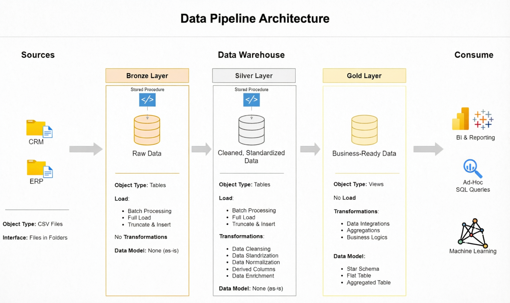
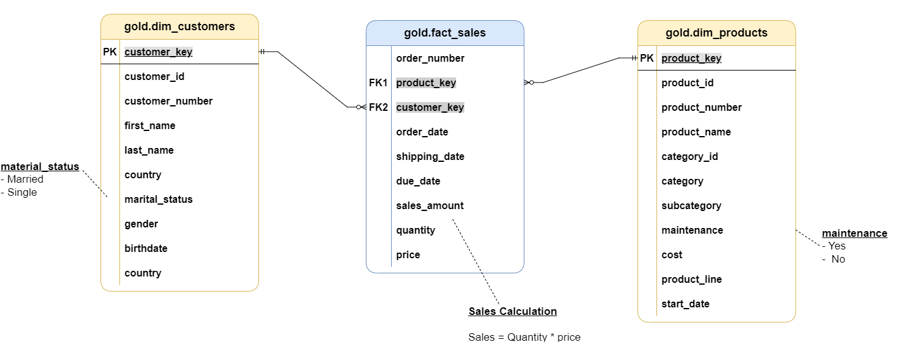
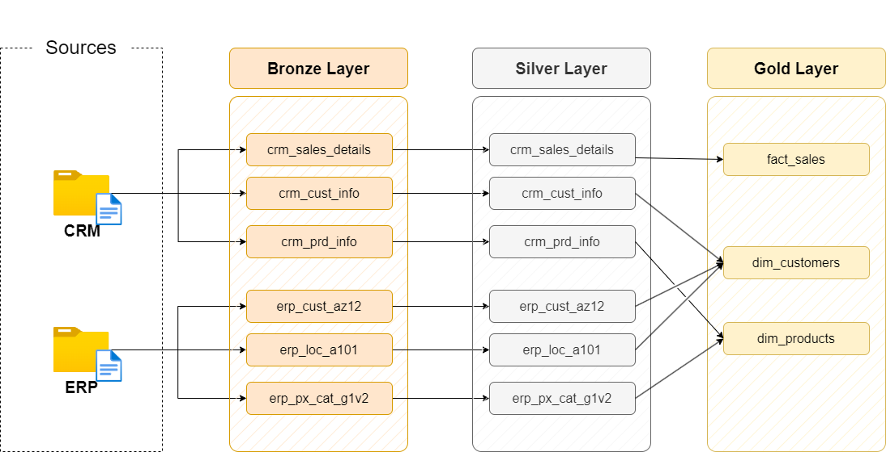
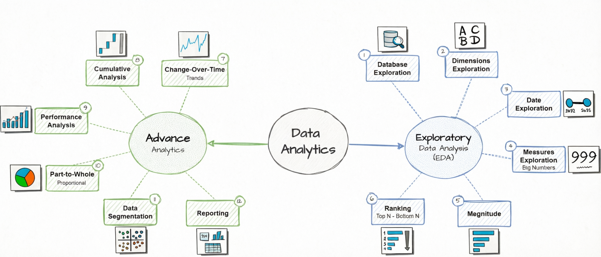
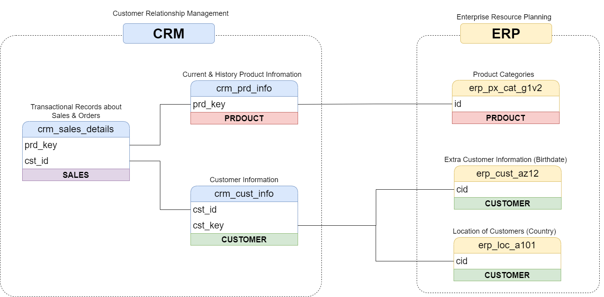

# Sales Data Analysis & Data Warehouse Project

**Project Implementation: Modern Data Warehouse & Business Intelligence Solution**

This repository contains a comprehensive data warehousing and analytics project that I developed to address critical business needs for sales data consolidation and strategic decision-making. The project demonstrates the complete implementation of a modern data warehouse with advanced business intelligence capabilities.

---

## 🎯 Project Background & Objectives

### Business Challenge
The organization required a unified view of sales data from multiple disconnected systems to enable data-driven decision-making and strategic business insights.

### Project Objectives
I was tasked with developing:

1. **Modern Data Warehouse**: Build a SQL Server-based data warehouse to consolidate sales data from multiple sources
2. **Analytical Reporting**: Enable comprehensive analytical reporting capabilities
3. **Business Intelligence**: Deliver actionable insights for strategic decision-making

### Key Deliverables
- **Customer Behavior Analytics**: Deep insights into customer patterns and preferences
- **Product Performance Metrics**: Comprehensive product analysis and profitability insights  
- **Sales Trend Analysis**: Revenue patterns, seasonality, and growth indicators

---

## 💼 My Role & Responsibilities

As the **Data Engineer & Analytics Lead**, I was responsible for:

- **Architecture Design**: Designed and implemented Medallion Architecture (Bronze, Silver, Gold layers)
- **ETL Pipeline Development**: Built comprehensive data extraction, transformation, and loading processes
- **Data Modeling**: Created optimized star schema with dimension and fact tables
- **Business Intelligence**: Developed SQL-based analytics delivering key business metrics
- **Quality Assurance**: Implemented data validation and quality checks throughout the pipeline

---

## 🏗️ Data Architecture

The data architecture follows the **Medallion Architecture** with Bronze, Silver, and Gold layers:



### Architecture Layers

1. **Bronze Layer**: Stores raw data as-is from source systems (ERP and CRM CSV files)
2. **Silver Layer**: Data cleansing, standardization, and normalization processes
3. **Gold Layer**: Business-ready data modeled into star schema for analytics and reporting



### Data Flow



---
## 📖 Project Overview

### Technical Implementation

This project demonstrates my ability to:

1. **Design Scalable Data Architecture**: Implemented Medallion Architecture with Bronze, Silver, and Gold layers
2. **Build Robust ETL Pipelines**: Created comprehensive data extraction, transformation, and loading processes
3. **Develop Efficient Data Models**: Designed star schema with optimized dimension and fact tables
4. **Generate Business Insights**: Built analytical queries for customer behavior, product performance, and sales trends

### Skills Demonstrated

🎯 This project showcases my expertise in:
- **SQL Development**: Advanced query design and optimization
- **Data Architecture**: Modern data warehouse design patterns
- **Data Engineering**: End-to-end pipeline development  
- **ETL Pipeline Development**: Data transformation and quality assurance  
- **Data Modeling**: Star schema and dimensional modeling  
- **Business Analytics**: Insight generation and reporting  

---

## 📊 Gold Layer Data Catalog

The Gold Layer represents the business-level data structured for analytical and reporting use cases. It follows a star schema with dimension tables and fact tables optimized for business intelligence.

### 🏪 Dimension Tables

#### **gold.dim_customers**
**Purpose**: Stores comprehensive customer details enriched with demographic and geographic data for customer analytics and segmentation.

| Column Name      | Data Type     | Description                                                                                   |
|------------------|---------------|-----------------------------------------------------------------------------------------------|
| customer_key     | INT           | Surrogate key uniquely identifying each customer record in the dimension table.               |
| customer_id      | INT           | Unique numerical identifier assigned to each customer.                                        |
| customer_number  | NVARCHAR(50)  | Alphanumeric identifier representing the customer, used for tracking and referencing.         |
| first_name       | NVARCHAR(50)  | The customer's first name, as recorded in the system.                                         |
| last_name        | NVARCHAR(50)  | The customer's last name or family name.                                                     |
| country          | NVARCHAR(50)  | The country of residence for the customer (e.g., 'Australia').                               |
| marital_status   | NVARCHAR(50)  | The marital status of the customer (e.g., 'Married', 'Single').                              |
| gender           | NVARCHAR(50)  | The gender of the customer (e.g., 'Male', 'Female', 'n/a').                                  |
| birthdate        | DATE          | The date of birth of the customer, formatted as YYYY-MM-DD (e.g., 1971-10-06).               |
| create_date      | DATE          | The date and time when the customer record was created in the system.                         |

#### **gold.dim_products**
**Purpose**: Provides detailed product information including attributes, categories, and pricing for product performance analysis.

| Column Name         | Data Type     | Description                                                                                   |
|---------------------|---------------|-----------------------------------------------------------------------------------------------|
| product_key         | INT           | Surrogate key uniquely identifying each product record in the product dimension table.         |
| product_id          | INT           | A unique identifier assigned to the product for internal tracking and referencing.            |
| product_number      | NVARCHAR(50)  | A structured alphanumeric code representing the product, often used for categorization or inventory. |
| product_name        | NVARCHAR(50)  | Descriptive name of the product, including key details such as type, color, and size.         |
| category_id         | NVARCHAR(50)  | A unique identifier for the product's category, linking to its high-level classification.     |
| category            | NVARCHAR(50)  | The broader classification of the product (e.g., Bikes, Components) to group related items.  |
| subcategory         | NVARCHAR(50)  | A more detailed classification of the product within the category, such as product type.      |
| maintenance_required| NVARCHAR(50)  | Indicates whether the product requires maintenance (e.g., 'Yes', 'No').                       |
| cost                | INT           | The cost or base price of the product, measured in monetary units.                            |
| product_line        | NVARCHAR(50)  | The specific product line or series to which the product belongs (e.g., Road, Mountain).      |
| start_date          | DATE          | The date when the product became available for sale or use.                                   |

### 💰 Fact Tables

#### **gold.fact_sales**
**Purpose**: Stores transactional sales data for comprehensive sales analytics, revenue tracking, and business performance metrics.

| Column Name     | Data Type     | Description                                                                                   |
|-----------------|---------------|-----------------------------------------------------------------------------------------------|
| order_number    | NVARCHAR(50)  | A unique alphanumeric identifier for each sales order (e.g., 'SO54496').                      |
| product_key     | INT           | Surrogate key linking the order to the product dimension table.                               |
| customer_key    | INT           | Surrogate key linking the order to the customer dimension table.                              |
| order_date      | DATE          | The date when the order was placed.                                                           |
| shipping_date   | DATE          | The date when the order was shipped to the customer.                                          |
| due_date        | DATE          | The date when the order payment was due.                                                      |
| sales_amount    | INT           | The total monetary value of the sale for the line item, in whole currency units (e.g., 25).   |
| quantity        | INT           | The number of units of the product ordered for the line item (e.g., 1).                       |
| price           | INT           | The price per unit of the product for the line item, in whole currency units (e.g., 25).      |

---

## 📈 Analytics Capabilities

This data model enables comprehensive business analytics across multiple dimensions:

### Customer Analytics
- Customer segmentation by demographics and geography
- Customer lifetime value analysis
- Purchase behavior patterns
- Customer retention and churn analysis

### Product Performance
- Sales performance by product categories and subcategories
- Product profitability analysis
- Inventory and maintenance requirements tracking
- Product line performance comparison

### Sales Analytics
- Revenue trends and seasonality analysis
- Sales cycle analysis (order to shipping time)
- Payment due date compliance tracking
- Order quantity and price distribution analysis

---


---

## 🚀 Project Implementation & Solutions

### Data Warehouse Development

#### Business Requirements Addressed
- **Data Silos**: Consolidated disconnected ERP and CRM systems into unified data warehouse
- **Data Quality Issues**: Implemented comprehensive data cleansing and validation framework
- **Reporting Challenges**: Created user-friendly analytical model for business stakeholders
- **Scalability Needs**: Designed architecture to support future data growth and new sources

#### Technical Solution Delivered
I successfully delivered a modern data warehouse solution featuring:
- **Multi-Source Integration**: Seamless integration of ERP and CRM data via automated ETL pipelines
- **Medallion Architecture**: Implemented Bronze (raw), Silver (cleaned), and Gold (business-ready) layers
- **Star Schema Design**: Optimized dimensional model with customer and product dimensions, sales fact table
- **Quality Assurance**: Built-in data validation and quality checks throughout the pipeline
- **Performance Optimization**: Efficient query design and indexing for fast analytics

---

### Business Intelligence & Analytics

#### Analytics Requirements Met
The project delivered comprehensive SQL-based analytics addressing key business questions:

**Customer Behavior Insights**
- Customer segmentation and demographic analysis
- Purchase pattern identification and lifetime value calculation
- Retention metrics and churn prediction indicators

**Product Performance Analysis**
- Sales performance across categories and subcategories
- Profitability analysis with cost and revenue metrics
- Inventory insights and maintenance requirements tracking

**Sales Trend Intelligence**
- Revenue trend analysis and seasonality patterns
- Sales cycle performance and shipping analytics
- Order analysis with quantity and price distribution insights

#### Business Value Delivered
These analytics empowered stakeholders with:
- **Strategic Decision-Making**: Data-driven insights for business planning
- **Performance Optimization**: Identifying top-performing products and customers
- **Operational Efficiency**: Improved inventory and shipping management
- **Revenue Growth**: Actionable insights for sales and marketing strategies

---

---

## 🛠️ Installation & Setup

### Prerequisites
- SQL Server (2019 or later)
- SQL Server Management Studio (SSMS) or similar SQL client
- Python 3.8+ (for running ETL scripts, optional)

### Quick Start

1. **Clone the repository**
   ```bash
   git clone https://github.com/your-username/sales-data-analysis.git
   cd sales-data-analysis
   ```

2. **Set up the database**
   ```sql
   -- Create the database
   CREATE DATABASE SalesDataWarehouse;
   GO
   
   USE SalesDataWarehouse;
   GO
   ```

3. **Run the ETL scripts in order**
   ```bash
   # Bronze Layer - Load raw data
   sqlcmd -S your-server -d SalesDataWarehouse -i scripts/bronze/load_raw_data.sql
   
   # Silver Layer - Clean and transform
   sqlcmd -S your-server -d SalesDataWarehouse -i scripts/silver/clean_transform_data.sql
   
   # Gold Layer - Create analytical model
   sqlcmd -S your-server -d SalesDataWarehouse -i scripts/gold/create_analytical_model.sql
   ```

4. **Verify the setup**
   ```sql
   -- Check Gold layer tables
   SELECT COUNT(*) AS customer_count FROM gold.dim_customers;
   SELECT COUNT(*) AS product_count FROM gold.dim_products;
   SELECT COUNT(*) AS sales_count FROM gold.fact_sales;
   ```

---

## � Analytics & Insights

### Business Intelligence Capabilities

The Gold Layer data model enables comprehensive business analytics across multiple dimensions:

#### 🏪 Customer Analytics
- **Customer Segmentation**: Analyze customer demographics and geographic distribution
- **Customer Lifetime Value**: Track customer spending patterns over time
- **Purchase Behavior**: Identify buying patterns and preferences
- **Customer Retention**: Monitor customer loyalty and churn metrics

#### 📦 Product Performance
- **Sales Performance**: Track product sales by categories and subcategories
- **Product Profitability**: Analyze margins and cost structures
- **Inventory Insights**: Monitor maintenance requirements and stock levels
- **Product Line Analysis**: Compare performance across different product lines

#### 💰 Sales Analytics
- **Revenue Trends**: Analyze seasonal patterns and growth trends
- **Sales Cycle Analysis**: Track order processing and shipping times
- **Payment Compliance**: Monitor due date adherence
- **Order Analysis**: Understand quantity and price distributions

### Data Analysis Workflow



---

## 🔄 Data Integration Process

### ETL Pipeline Architecture

The project implements a comprehensive data integration process that transforms raw data into actionable business insights:



### Key Features
- **Automated Data Loading**: Streamlined ingestion from ERP and CRM systems
- **Data Quality Assurance**: Built-in validation and cleansing mechanisms
- **Scalable Architecture**: Designed to handle growing data volumes
- **Real-time Processing**: Support for near real-time analytics

---

## 📂 Repository Structure
```
data-warehouse-project/
│
├── datasets/                           # Raw datasets used for the project (ERP and CRM data)
│
├── docs/                               # Project documentation and architecture details
│   ├── etl.drawio                      # Draw.io file shows all different techniquies and methods of ETL
│   ├── data_architecture.drawio        # Draw.io file shows the project's architecture
│   ├── data_catalog.md                 # Catalog of datasets, including field descriptions and metadata
│   ├── data_flow.drawio                # Draw.io file for the data flow diagram
│   ├── data_models.drawio              # Draw.io file for data models (star schema)
│   ├── naming-conventions.md           # Consistent naming guidelines for tables, columns, and files
│
├── scripts/                            # SQL scripts for ETL and transformations
│   ├── bronze/                         # Scripts for extracting and loading raw data
│   ├── silver/                         # Scripts for cleaning and transforming data
│   ├── gold/                           # Scripts for creating analytical models
│
├── tests/                              # Test scripts and quality files
│
├── README.md                           # Project overview and instructions
├── LICENSE                             # License information for the repository
├── .gitignore                          # Files and directories to be ignored by Git
└── requirements.txt                    # Dependencies and requirements for the project
```
---

<<<<<<< HEAD
](https://www.youtube.com/@datawithbaraa)
=======
---

## 🛡️ License

This project is licensed under the [MIT License](LICENSE). You are free to use, modify, and share this project with proper attribution.

## 🌟 About the Developer

Hi there! I'm **Hadil Sahraoui**, a passionate data professional with expertise in data engineering, business analytics, and database architecture. I developed this comprehensive sales data analysis project to demonstrate end-to-end data warehouse implementation and business intelligence capabilities.

### Connect With Me

Feel free to connect with me on the following platforms:

[](https://github.com/hadsa129)
[](https://linkedin.com/in/hadil-sahraoui)
[](mailto:hadil.sahraoui@example.com)

### Project Highlights

This project represents my commitment to:
- **Building Scalable Solutions**: Modern data architecture using industry best practices
- **Delivering Business Value**: Actionable insights that drive strategic decisions
- **Continuous Learning**: Staying current with data engineering and analytics trends
- **Quality craftsmanship**: Clean, well-documented, and maintainable code
>>>>>>> f5a699e (Update project framing as professional data warehouse implementation)
